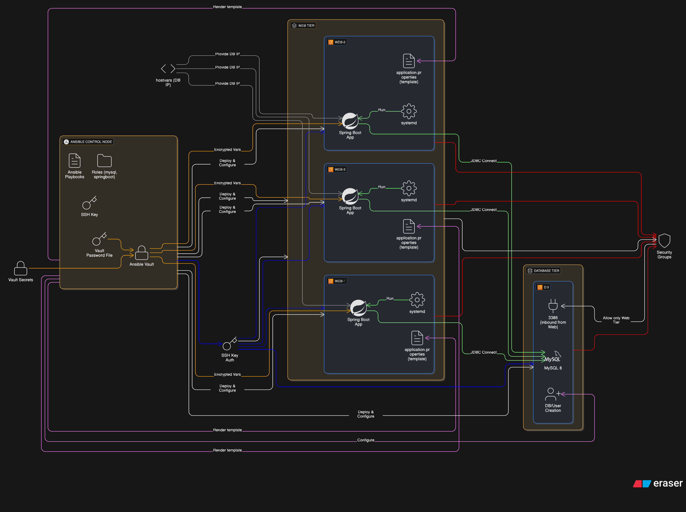

# 🚀 Ansible Automated Spring Boot Deployment — Multi-EC2 | MySQL | Vault

[](https://github.com/Rahul-Kumar-Paswan/ansible-app-orchestrator.git)


---

## 📌 Project Overview

**Ansible App Orchestrator** is a fully automated multi-tier application deployment system that provisions:

- Multiple EC2 web servers running a **Spring Boot application**
- A dedicated EC2 **MySQL database server**
- **Secure secret management** using **Ansible Vault**
- **Idempotent, reusable Ansible roles** for MySQL and Spring Boot

This project demonstrates **real-world DevOps automation**, ideal for **production-grade deployments** and **portfolio demonstration**.

<!-- Automated deployment and orchestration of a multi-tier Spring Boot application with MySQL using Ansible. Demonstrates secure secret management (Vault), role-based modular playbooks, and repeatable infrastructure automation on AWS EC2 instances. -->

---
## 🧭 Table of Contents

- [Project Overview](#project-overview)
- [Features](#features)
- [Architecture Diagram](#architecture-diagram)
- [Project Structure](#project-structure)
- [Tech Stack](#tech-stack)
- [Prerequisites](#prerequisites)
- [Roles Overview](#roles-overview)
- [Vault Usage](#vault-usage)
- [Setup and Deployment](#setup-and-deployment)
- [Adding More Web Servers](#adding-more-web-servers)
- [Screenshots](#screenshots)
- [Learning & Takeaways](#learning--takeaways)
- [Future Enhancements](#future-enhancements)
- [Author & Portfolio](#author--portfolio)
- [License](#license)

---
## 🚀 Features

- **Role-based automation**
- **mysql** → Install, configure, and secure MySQL
- **springboot** → Deploy Spring Boot JAR using `systemd`
- **Multi-server deployment** (web + db tiers)
- **Dynamic DB injection** using `hostvars`
- **Templated configuration** (`application.properties.j2`)
- **Secure secrets** using **Ansible Vault**
- **Clean, production-style folder structure**

---
## 🧱 Architecture Diagram
                    ┌──────────────────────┐
                    │     Ansible Control   │
                    │    (Your machine)     │
                    └──────────┬───────────┘
                               │ SSH + Vault
     ┌─────────────────────────┼──────────────────────────┐
     │                         │                          │
┌──────────┐           ┌──────────┐              ┌──────────┐
│  web-1   │           │  web-2   │              │  web-3   │
│ Spring   │           │ Spring   │              │ Spring   │
│ Boot App │           │ Boot App │              │ Boot App │
└────┬─────┘           └────┬─────┘              └────┬─────┘
     │                       │                         │
     └──────────────┬────────┴──────────────┬─────────┘
                    │                       │
                ┌──────────┐ 3306/TCP  ┌──────────┐
                │  DB EC2  │──────────▶│  MySQL   │
                └──────────┘           └──────────┘




---
## 📁 Project Structure
```text
ansible-app-orchestrator/
├── LICENSE
├── README.md
├── ansible
│   ├── ansible.cfg
│   ├── inventory
│   │   └── hosts.ini
│   ├── playbook
│   │   ├── app-deploy.yml
│   │   └── mysql-deploy.yml
│   ├── roles
│   │   ├── mysql
│   │   └── springboot
│   └── vault
│       └── vault_pass.txt
├── rahulverse-user-portal (Spring Boot App)
└── screenshots

```

---
## 🛠️ Tech Stack
| Layer       | Technologies                  |
| ----------- | ----------------------------- |
| Automation  | Ansible, Ansible Vault        |
| App Tier    | Spring Boot, Java, Thymeleaf  |
| DB Tier     | MySQL 8                       |
| Cloud       | AWS EC2                       |
| OS          | Ubuntu 22.04                  |
| Init System | systemd                       |
| Security    | Vault-based secret encryption |

---

## 🛠️ Prerequisites

- **Ansible ≥ 2.9**  
- **Python3** on target servers  
- **EC2 instances** with SSH access  
- **Vault password file** (`ansible/vault/vault_pass.txt`)  
- **JDK 11+** installed on web servers  

---

## 🧩 Roles Overview

### 🔹 MySQL Role
- Installs **MySQL 8**
- Creates **database & users**
- Enables **remote access**
- Secures credentials with **Ansible Vault**

### 🔹 Spring Boot Role
- Copies **JAR file** to target servers
- Renders `application.properties` template
- Renders **systemd service file**
- Starts and enables **Spring Boot service** 

---
## 🔐 Vault Usage

**Encrypted files include:**

- `roles/mysql/vars/main.yml`
- `roles/springboot/vars/main.yml`

**Decrypt (if needed):**  
```bash
ansible-vault decrypt <file>
```
**Encrypt again:**  
```bash
ansible-vault encrypt <file>
```

**Vault password is stored at:**  
`ansible/vault/vault_pass.txt`

---

## ⚙️ Setup and Deployment

1. **Encrypt secrets using Vault** (already done in this project):
```bash
ansible-vault encrypt ansible/roles/mysql/vars/main.yml
ansible-vault encrypt ansible/roles/springboot/vars/main.yml
```

2. **Inventory example** (ansible/inventory/hosts.ini):
```yaml
[webserver]
web-1 ansible_host=<PUBLIC_IP> ansible_user=ubuntu ansible_ssh_private_key_file=/path/to/key.pem
web-2 ansible_host=<PUBLIC_IP> ansible_user=ubuntu ansible_ssh_private_key_file=/path/to/key.pem

[dbserver]
db ansible_host=<PUBLIC_IP> ansible_user=ubuntu ansible_ssh_private_key_file=/path/to/key.pem
```

3. **Run MySQL deployment first:**
```bash
ansible-playbook -i ansible/inventory/hosts.ini ansible/playbook/mysql-deploy.yml --vault-password-file ansible/vault/vault_pass.txt
```

4. **Deploy Spring Boot application:**
```bash
ansible-playbook -i ansible/inventory/hosts.ini ansible/playbook/app-deploy.yml --vault-password-file ansible/vault/vault_pass.txt
```

5. **Verify application:**
Access the application at: http://<WEB_SERVER_IP>:8080/

---

## 🔧 Adding More Web Servers

- Add new web server(s) to the **[webserver]** group in `hosts.ini`.
- Run the app deployment playbook again — it will automatically deploy the app to the newly added servers.

---
## 📸 Screenshots


_For more UI pages, check the [`/screenshots`](./screenshots) folder._

---
## 🎯Learning & Takeaways

- ✔ **Infrastructure Automation**
- ✔ **Secrets Management**
- ✔ **Multi-tier Deployment**
- ✔ **Linux System Administration**
- ✔ **Configuration Management**
- ✔ **CI-ready, role-based framework**
- ✔ **Reusable Ansible architecture**

---

## 💡 Future Enhancements

- CI/CD integration with **Jenkins / GitHub Actions**
- Containerization using **Docker** for web and DB services
- Load Balancer and auto-scaling with **AWS ELB / ASG**
- Monitoring with **Prometheus / Grafana**

---

## 📝 Author & Portfolio

**Rahul Paswan**

- **GitHub:** https://github.com/Rahul-Kumar-Paswan  
- **Portfolio:** https://rahulpaswanverse.vercel.app  


---
## 📝 License

MIT License © 2025 Rahul Paswan
This project is licensed under the [MIT License](./LICENSE).
