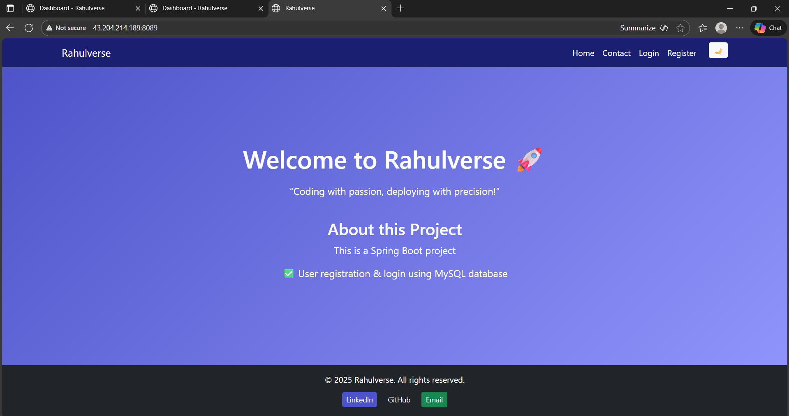

## 🚀 SpringBoot-Fullstack-UserPortal

SpringBoot-Fullstack-UserPortal is a full-stack user management application built with Spring Boot, Thymeleaf, and MySQL.


_For more UI pages, check the [`/screenshots`](./screenshots) folder._

## 🖥️ Project Overview

A full-stack web app built with:

- **Backend:** Spring Boot (Java), MySQL
- **Frontend:** Thymeleaf templates (server-side rendered)
- **Authentication:** Simple login/register with session management
- **Database:** MySQL for persistence

## 🧰 Technologies Used

| Layer    | Tech Stack                    |
| -------- | ----------------------------- |
| Backend  | Spring Boot, Java, JPA, MySQL |
| Frontend | Thymeleaf, HTML, CSS          |
| Database | MySQL                         |

## ⚙️ Prerequisites

Ensure the following are installed and running:

- Java 17+
- Maven 3.8+
- MySQL Server (running locally on default port 3306)

## 🔐 Environment Variables

Create a `.env` file at the root of the project folder (where `pom.xml` is located) with the following content:

```bash
SERVER_PORT=8089
DB_HOST=localhost    # or mysql (container name if using Docker)
DB_PORT=3306
DB_NAME=your_db_name
DB_USER=root
DB_PASSWORD=your_rootpassword
```

Make sure to export these variables before running the app:
```bash
export SERVER_PORT=8089
export DB_HOST=localhost
export DB_PORT=3306
export DB_NAME=your_db_name
export DB_USER=root
export DB_PASSWORD=your_rootpassword
```

## 🏁 Local Development Setup

Start MySQL server
Make sure MySQL is running and accessible with the credentials in .env.

Create database and table (if not already created):
```bash
mysql -u root -p

-- Inside MySQL shell:
CREATE DATABASE maven_users;
USE maven_users;

CREATE TABLE users (
  id INT AUTO_INCREMENT PRIMARY KEY,
  email VARCHAR(255) NOT NULL UNIQUE,
  name VARCHAR(100),
  password VARCHAR(255)
);
```

Build and run the application
```bash
mvn clean spring-boot:run
```

Access the app

Open your browser and visit:
http://localhost:8089

## 📁 Project Structure
```bash
SpringBoot-Fullstack-UserPortal/
├── pom.xml
├── screenshots/
├── src/
│   ├── main/
│   │   ├── java/com/rahulverse/
│   │   │   ├── AuthController/
│   │   │   ├── controller/
│   │   │   ├── model/
│   │   │   ├── repository/
│   │   │   ├── service/
│   │   │   └── RahulverseApplication.java
│   │   └── resources/
│   │       ├── application.properties
│   │       └── templates/
│   └── test/
├── LICENSE
└── README.md
```

## ✨ Features
- User Registration → /register  
- Login/Logout → /login, /logout  
- Dashboard (post-login) → /dashboard  
- Contact Page → /contact  

## 🔮 Roadmap

🐳 Dockerize the application (branch: containerization)

☸️ Kubernetes deployment (branch: kubernetes)

🔄 CI/CD with Jenkins (branch: cicd-jenkins)

🏗️ Infrastructure as Code with Terraform on AWS EC2 & EKS (branch: terraform-infra)

📊 Production deployment & monitoring (branch: prod)


## 📝 License

MIT License © 2025 Rahul Paswan
This project is licensed under the [MIT License](./LICENSE).
